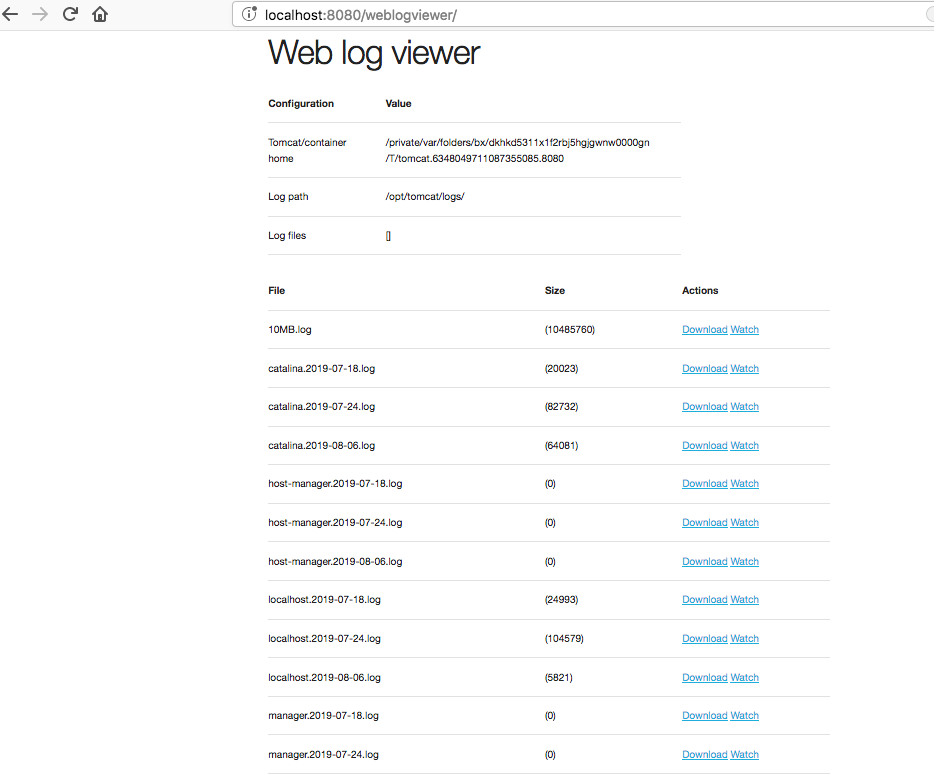

# Web log viewer

Web application for listing, viewing and downloading log files from 
a plain web interface.

The application is written using Spring-Boot and can run on the following modes:

  -  Requires Java-8 or later
  -  Standalone mode (http://localhost:8080/weblogviewer) 
```
java -jar weblogviewer.war
```
  -  Within a container (deploy __weblogviewer.war__)  
  -  Starts on the context path */weblogviewer*
  
 
  
## Configuration

```
  logviewer.path     (empty by default) = Path for log files, it will filter all the files from this directory e.g. /var/lib/tomcat/logs 
  logviewer.files    (empty by default) = Comma separated list of specific paths for log files e.g. /var/log/app1.log,/var/log/app2.log 
  logviewer.extension (.log by default) = Comma separated list of file name extensions to filter 
```

All options can be configured by either passing the configuration properties as:

  -  When running on a container, VM arguments (-DpropertyName=propertyValue)
  
```
CATALINA_OPTS=".... -Dlogviewer.path=/var/lib/tomcat/logs/"
```

  -  When running as standalone app, VM arguments (-DpropertyName=propertyValue) or specify an external configuration file via __spring.config.location__ (see [spring-boot-external-config](https://docs.spring.io/spring-boot/docs/current/reference/html/boot-features-external-config.html))
  
```
java -jar -Dlogviewer.path=/var/lib/tomcat/logs/ weblogviewer.war 
```

```
java -jar weblogviewer.war --spring.config.location=config.properties 
```

### Tomcat execution
When running within a Tomcat container, it will automatically identify it and provide the logs for it